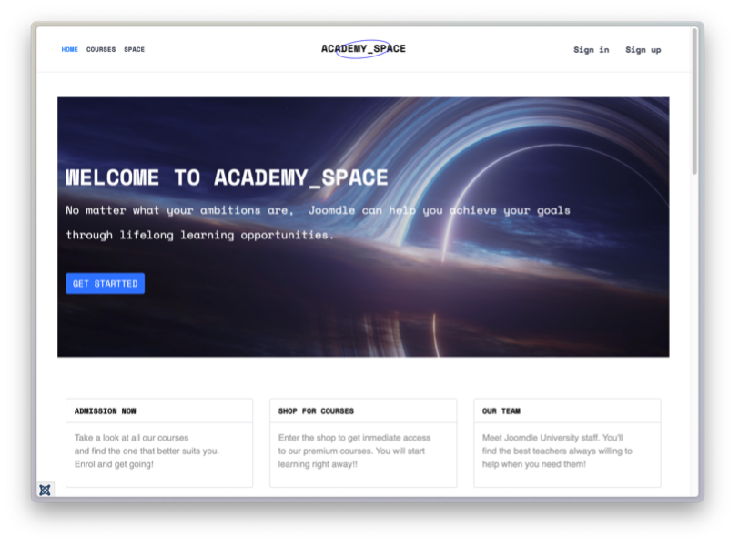
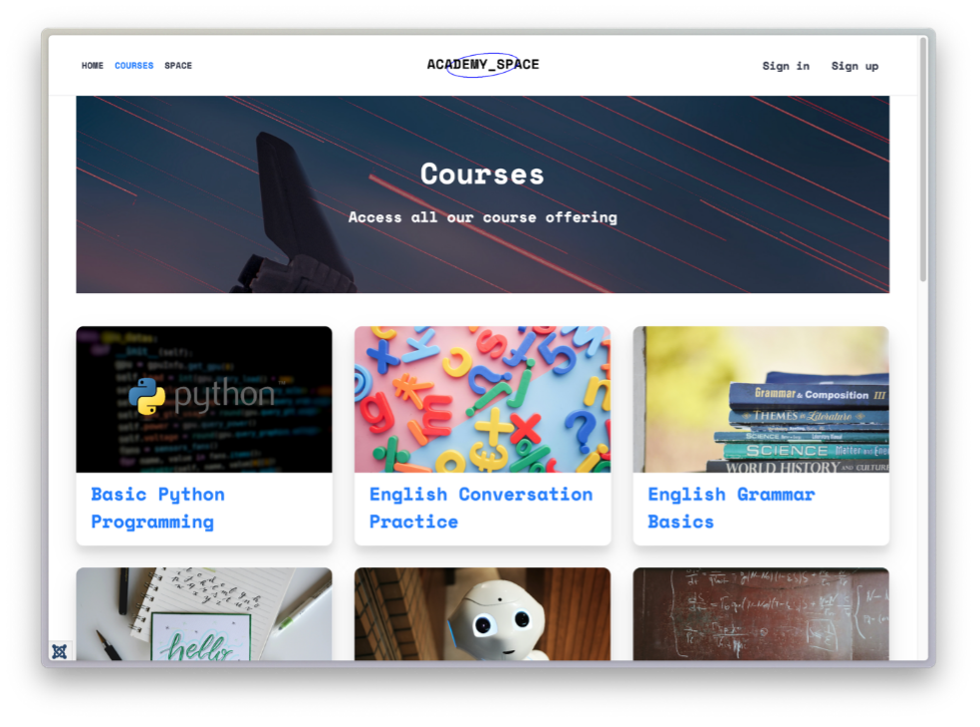
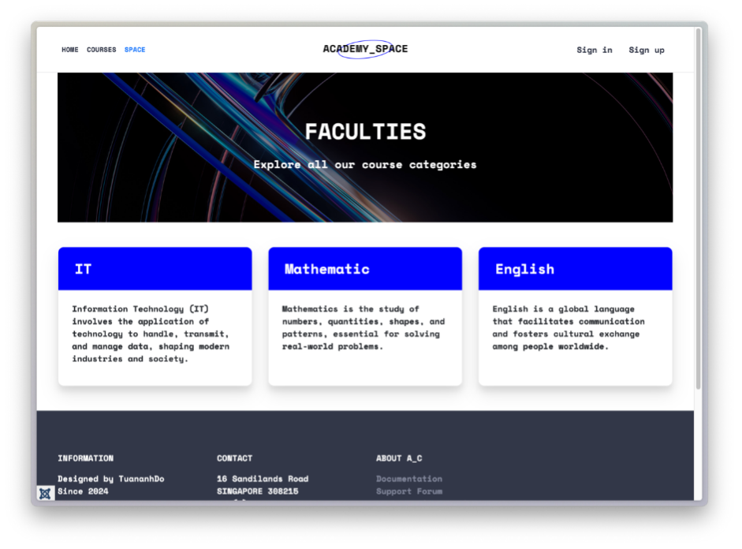
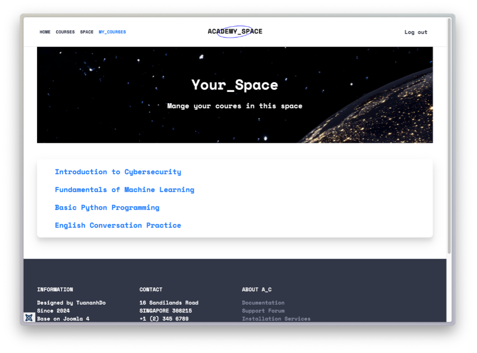
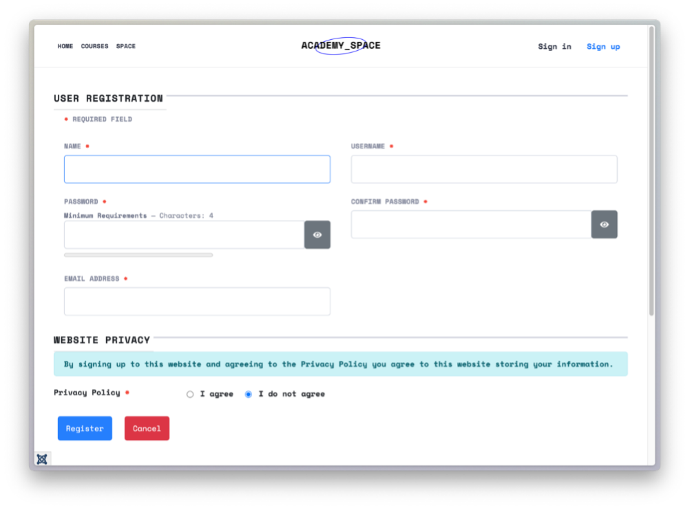
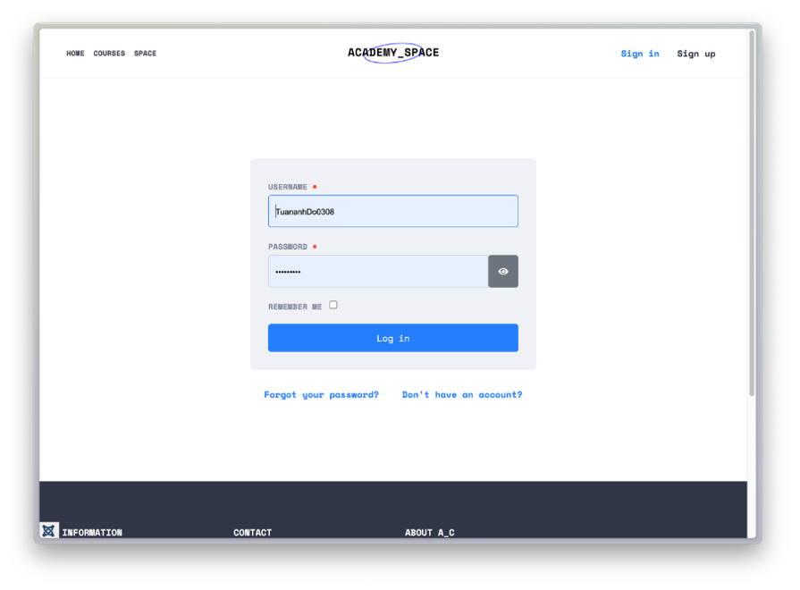

# Online Learning Platform - Joomla & Joomdle

## Description

This is a web-based online learning platform developed using **Joomla**, **Moodle**, and **Joomdle** to deliver a seamless and interactive educational experience. The platform provides a user-friendly interface for learners to access diverse courses, manage their learning progress, and engage with educational content. It integrates Joomla's content management capabilities with Moodle's robust learning management system (LMS) through Joomdle, creating a flexible and scalable solution for online education.

---

## Related Repositories

This project is a standalone application developed as part of a university assignment. The source code and related assets can be found in the project's repository:


---

## Preview

### 1. Website UI


### 2. Key Features
#### Courses Page


#### Space Page


#### My Courses Page


#### Other Pages



---

### Features

- **User Authentication:** Secure sign-up, sign-in, and logout functionality for learners.
- **Course Catalog:** Browse and explore a diverse range of courses across various fields.
- **Personalized Learning:** Access enrolled courses via the "My Courses" section (available only to logged-in users).
- **Content Management:** Easily manage and publish educational content using Joomla’s CMS.
- **Learning Management:** Deliver interactive courses, quizzes, and assignments through Moodle’s LMS.
- **Responsive Design:** Optimized for desktops, tablets, and mobile devices using Bootstrap.
- **Drag-and-Drop Builder:** Create professional pages with SP Page Builder Lite’s intuitive interface.

---

## Table of Contents

- [Getting Started](#getting-started)
- [Prerequisites](#prerequisites)
- [Installation](#installation)
- [Configuration](#configuration)
- [Run the Project](#run-the-project)
- [Usage](#usage)
- [Tech Stack](#tech-stack)
- [License](#license)

---

## Getting Started

Follow these steps to set up and run the project locally.

---

## Prerequisites

Ensure you have the following installed on your system:

- **Web Server:** Apache or Nginx.
- **PHP:** Version 7.4 or higher.
- **MySQL:** Version 5.7 or higher.
- **Joomla:** Version 3.x or 4.x (check project requirements for exact version).
- **Moodle:** Version 3.x or higher.
- **Joomdle:** Latest version compatible with Joomla and Moodle.
- **Git:** For cloning the repository (optional).

---

## Installation

1. Clone the repository to your local machine (if available):

   ```bash
   git clone https://github.com/TuananhDo0308/online-learning-platform.git
   cd online-learning-platform
   ```

2. Set up the web server:

   - Copy the project files to your web server’s root directory (e.g., `htdocs` for Apache).
   - Ensure the server supports PHP and MySQL.

3. Install Joomla:

   - Access the Joomla installer via your browser (e.g., `http://localhost/online-learning-platform`).
   - Follow the on-screen instructions to configure the database and admin account.

4. Install Moodle:

   - Download Moodle from [moodle.org](https://moodle.org) and place it in a subdirectory (e.g., `moodle`).
   - Run the Moodle installer via your browser (e.g., `http://localhost/online-learning-platform/moodle`).
   - Configure the database and complete the setup.

5. Install Joomdle:

   - Download Joomdle from [joomdle.com](https://www.joomdle.com).
   - Install the Joomdle extension in Joomla via the **Extensions > Manage > Install** panel.
   - Install the Joomdle plugin in Moodle through the **Site Administration > Plugins** section.

6. Install SP Page Builder Lite:

   - Download SP Page Builder Lite from the Joomla Extensions Directory or [JoomShaper](https://www.joomshaper.com).
   - Install it in Joomla via the **Extensions > Manage > Install** panel.

---

## Configuration

1. Configure the database:

   - Create two MySQL databases: one for Joomla and one for Moodle.
   - Update the configuration files:
     - Joomla: Edit `configuration.php` in the Joomla root directory with your database details.
     - Moodle: Edit `config.php` in the Moodle directory with your database details.

   Example for Joomla (`configuration.php`):

   ```php
   public $dbtype = 'mysqli';
   public $host = 'localhost';
   public $user = 'your_username';
   public $password = 'your_password';
   public $db = 'joomla_db';
   ```

2. Configure Joomdle:

   - In Joomla, go to **Components > Joomdle > Configuration** and set the Moodle URL (e.g., `http://localhost/online-learning-platform/moodle`).
   - In Moodle, enable the Joomdle plugin and configure the Joomla URL.
   - Test the connection to ensure Joomla and Moodle are integrated.

3. Set up SP Page Builder Lite:

   - In Joomla, go to **Components > SP Page Builder** and create or edit pages using the drag-and-drop interface.
   - Customize templates and elements to match your design preferences.

4. Deploy to a domain (optional):

   - Purchase a domain and hosting service.
   - Upload the project files to the hosting server via FTP or a control panel.
   - Update the database connection settings and Joomla/Moodle URLs to reflect the live domain.

---

## Run the Project

### Local Development

1. Start your web server (Apache/Nginx) and MySQL.
2. Access the Joomla frontend via your browser (e.g., `http://localhost/online-learning-platform`).
3. Log in to the Joomla admin panel (e.g., `http://localhost/online-learning-platform/administrator`) to manage content.
4. Access Moodle via its URL (e.g., `http://localhost/online-learning-platform/moodle`) to manage courses.

### Production

1. Upload the project to your hosting server.
2. Import the Joomla and Moodle databases using a tool like phpMyAdmin.
3. Update configuration files with the live server’s database and URL settings.
4. Access the live site via your domain (e.g., `http://yourdomain.com`).

---

## Usage

Once the platform is running, users can:

- **Browse Courses:** Explore available courses on the **Courses** page and filter by category on the **Space** page.
- **Sign Up/Sign In:** Create an account or log in to access personalized features like **My Courses**.
- **Enroll in Courses:** Register for courses and access learning materials, quizzes, and assignments.
- **Manage Learning:** Track progress and complete courses through the Moodle-integrated interface.
- **Log Out:** Securely log out to protect account privacy.

Admins can:

- Manage content and pages via Joomla’s admin panel.
- Create and organize courses in Moodle.
- Monitor user activity and course performance through Joomdle.

---

## Tech Stack

The project uses the following technologies:

- **Joomla:** Open-source CMS for managing website content and user interfaces.
- **Moodle:** Open-source LMS for course creation, management, and delivery.
- **Joomdle:** Integration layer connecting Joomla and Moodle.
- **SP Page Builder Lite:** Drag-and-drop page builder for creating responsive pages in Joomla.
- **PHP:** Server-side scripting for Joomla and Moodle.
- **MySQL:** Database for storing content, user data, and course information.
- **Bootstrap:** Framework for responsive and mobile-friendly design.

---

## License

This project is licensed under the [MIT License](LICENSE).

---

## Acknowledgments

- **Instructors:** ThS. Trần Sơn Hải and ThS. Lê Thanh Thoại, for their guidance and support.
- **Team Member:** Đỗ Trần Tuấn Anh, for researching, developing, and documenting the project.
- **References:**
  - [Joomla Official Website](https://www.joomla.org)
  - [Joomdle Official Website](https://www.joomdle.com)
  - [Moodle Official Website](https://moodle.org)

---

## Future Development

To enhance the platform, the following features could be added:

- **Expanded Course Catalog:** Include more diverse courses across various fields.
- **Course Marketplace:** Enable buying and selling courses on the platform.
- **Learning Scheduler:** Allow users to organize and schedule their course timelines.
- **Competitions and Events:** Host online quizzes and contests to engage learners.
- **Certificates:** Provide digital certificates upon course completion.

---

This **Online Learning Platform** is a powerful tool for delivering accessible and interactive education, leveraging open-source technologies to meet modern learning needs. Happy learning! 📚
